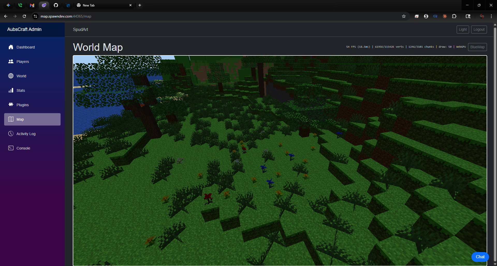

# AubsCraft

A real-time Minecraft server admin panel and **GPU-accelerated 3D world viewer** built with **Blazor WebAssembly**, **SpawnDev.ILGPU** (WebGPU), and **ASP.NET Core**. Browser-based server management with a live, interactive 3D map - no plugins required on the Minecraft side.

Built by [Todd Tanner (@LostBeard)](https://github.com/LostBeard) for his daughter Aubriella's Minecraft server (mc.spawndev.com).

**Powered by the [SpawnDev](https://github.com/LostBeard) ecosystem:**
- [SpawnDev.BlazorJS](https://github.com/LostBeard/SpawnDev.BlazorJS) - Full JS interop for Blazor WASM
- [SpawnDev.ILGPU](https://github.com/LostBeard/SpawnDev.ILGPU) - GPU compute on all 6 backends (WebGPU, WebGL, Wasm, CUDA, OpenCL, CPU)

---

## 3D World Viewer



A real-time GPU-accelerated Minecraft world renderer running entirely in the browser via WebGPU.

### Rendering Features
- **Full 3D voxel rendering** via ILGPU compute kernels on WebGPU
- **Per-face block textures** - bark on log sides, rings on top/bottom, grass_block_side, dirt bottom (all 8 log types)
- **Transparent water** - two-pass rendering with alpha blending, seabed visible through water at all distances
- **Cross-shaped plant quads** - flowers, grass, and ferns render as intersecting diagonal planes (like real Minecraft)
- **Texture atlas** - 90+ textures in a 256x256 atlas, nearest-neighbor filtering for pixel art style
- **Dual lighting** - directional sun + fill light + ambient, per-face brightness multipliers
- **Distance fog** - smooth quadratic falloff blending to sky color
- **Leaf transparency** - alpha discard for leaf cutouts
- **Adaptive draw distance** - automatically adjusts based on FPS (10-50 chunk radius)
- **Frustum culling** - only renders visible chunks

### Architecture
- **Dedicated render worker** - entire GPU pipeline runs in a Web Worker via OffscreenCanvas
- **Binary WebSocket streaming** - raw binary chunk data, no JSON, no base64
- **OPFS region-file cache** - 275 MB/s reads, instant world on revisit
- **ILGPU HeightmapMeshKernel** - GPU-accelerated heightmap meshing (replaced CPU mesher)
- **CopyFromJS** - zero .NET allocation data path from JS WebSocket to GPU buffers
- **Camera-prioritized loading** - chunks load outward from camera position

### Controls
- **WASD + mouse** - first-person fly camera with pointer lock
- **Pointer lock recovery** - automatically detects when Windows steals focus
- **FPS camera** - 60 blocks/sec movement, configurable FOV

## Admin Panel

### Dashboard
- **Real-time player count and TPS** with live history graph via SignalR
- **Server status** - connected/disconnected, 1m/5m/15m TPS readings
- **Who's playing** - live player list with platform detection (Java, Bedrock, VR)

### Player Management
- **Whitelist** - add/remove with player avatars
- **Online players** - kick, ban, pardon with one click
- **Gamemode control** - switch between survival, creative, spectator, adventure
- **Teleport** - teleport any player to any other player
- **Player profiles** - play time, deaths, mob kills, blocks placed/broken, distance, advancements

### World Controls
- **Time/weather** - set time of day, weather, save world
- **Server broadcast** - send messages to all players
- **Activity log** - real-time timeline with filterable events
- **Live chat** - see and respond to in-game chat
- **Server console** - send any RCON command
- **Plugin manager** - view, enable/disable, install from Modrinth
- **Server control** - start, stop, restart via systemd

---

## Roadmap

See [PLANS.md](PLANS.md) for the full 19-phase development plan with 140+ features.

### Completed
- [x] **Phase A** - Admin Panel (dashboard, players, world controls, console, plugins)
- [x] **Phase B** - 3D World Viewer Core (WebGPU, ILGPU kernels, heightmap, atlas)
- [x] **Phase C** - Viewer Polish (per-face textures, water transparency, plants, seabed, pointer lock)
- [x] **Phase D (partial)** - Binary WebSocket, OPFS cache, render worker, CopyFromJS

### In Progress
- [ ] **Phase D** - Zero-copy JS ArrayBuffer pipeline, radial loading, offline mode
- [ ] **Phase D2** - Input system (gamepad, mobile touch, fullscreen modes)

### Planned
- [ ] **Phase E** - Visual features (time-of-day lighting, weather, entities, biome tinting)
- [ ] **Phase F** - Map navigation + HUD (compass, coordinates, minimap, deep-linking)
- [ ] **Phase G** - Multi-user auth with admin levels
- [ ] **Phase H** - MC account linking (AubsCraftLink plugin)
- [ ] **Phase I** - GriefPrevention claim visualization
- [ ] **Phase J** - Player system (live positions, skin rendering, spectate)
- [ ] **Phase K** - Web-to-game chat bridge
- [ ] **Phase L** - Browser creative mode (base editing from the web)
- [ ] **Phase M** - Public player profiles
- [ ] **Phase N** - AI villager NPCs (Claude-powered, voice chat)
- [ ] **Phase O** - Multi-dimension maps (Nether, End)
- [ ] **Phase P** - Spectator cam + drone cam + streaming
- [ ] **Phase Q** - WebXR VR/AR mode (Quest 3 passthrough, tabletop world)
- [ ] **Phase R** - Inventory management from browser
- [ ] **Phase S** - Data analytics (CoreProtect integration, heatmaps)
- [ ] **Phase Z** - The North Star: browser-based Minecraft client

### Custom Paper Plugins (Planned)
| Plugin | Purpose |
|--------|---------|
| VRDetect | VR player detection (DONE) |
| AubsCraftLink | MC account to web account linking |
| AubsCraftClaims | GriefPrevention claim data API |
| AubsCraftTracker | Real-time player position broadcasting |
| AubsCraftChat | Web-to-game chat bridge |
| AubsCraftBuild | Browser creative mode block placement |
| AubsCraftAI | AI villager NPCs |
| AubsCraftInventory | Web inventory management |

---

## Requirements

- [.NET 10.0 SDK](https://dotnet.microsoft.com/) (for building)
- Minecraft Paper or Spigot server with RCON enabled
- WebGPU-capable browser (Chrome 113+, Edge 113+)

## Quick Start

1. Clone the repository
2. Edit `AubsCraft.Admin.Server/appsettings.json` with your server details:
   ```json
   {
     "Rcon": {
       "Host": "127.0.0.1",
       "Port": 25575,
       "Password": "your_rcon_password"
     },
     "Minecraft": {
       "LogPath": "/opt/minecraft/server/logs/latest.log"
     }
   }
   ```
3. Run the server:
   ```bash
   dotnet run --project AubsCraft.Admin.Server
   ```
4. Open the URL shown in your browser
5. Create your admin account on first launch

## Project Structure

| Project | Description |
|---------|-------------|
| `AubsCraft.Admin` | Blazor WebAssembly frontend - UI pages, 3D renderer, GPU kernels |
| `AubsCraft.Admin.Server` | ASP.NET Core host - RCON bridge, SignalR, binary WebSocket, world data |
| `SpawnDev.Rcon` | Standalone Source RCON protocol client library (TCP, async, reusable) |
| `VRDetect` | Paper plugin (Java) - detects Vivecraft VR players |
| `Research/` | 23 design documents covering every planned feature |

## Tech Stack

- **Frontend** - Blazor WebAssembly (.NET 10), Bootstrap 5, SignalR, WebGPU
- **GPU Compute** - SpawnDev.ILGPU (WebGPU backend) for all mesh generation
- **JS Interop** - SpawnDev.BlazorJS for WebSocket, OPFS, IndexedDB, WebXR
- **Backend** - ASP.NET Core (.NET 10), SignalR hub, binary WebSocket, Source RCON
- **Caching** - OPFS region files (275 MB/s read, instant startup)
- **Rendering** - WebGPU with WGSL shaders, two-pass opaque + transparent pipeline
- **Worker** - Dedicated Web Worker with OffscreenCanvas for render isolation
- **Deployment** - Self-contained linux-x64, systemd service, SSH + mapped drive deploy

## Cross-Platform Support

Players and viewers detected by platform:
- **Java** - standard Minecraft Java Edition
- **Bedrock** - players connecting via GeyserMC (Floodgate prefix)
- **VR** - Vivecraft players (VRDetect plugin)
- **Web Viewer** - browser-based spectators (planned: visible in-game as drones/birds)

## License

MIT - see [LICENSE](LICENSE)
